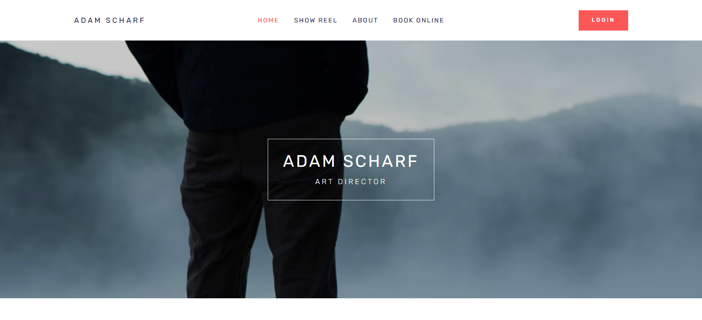
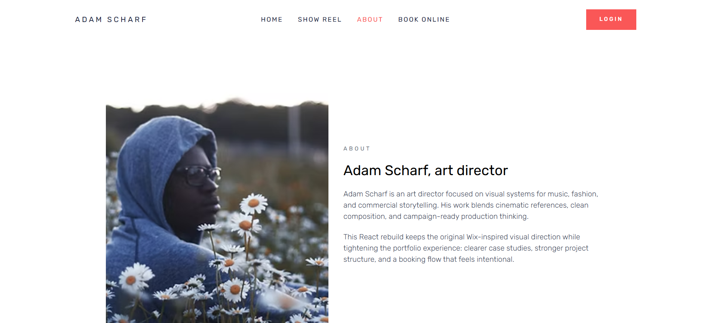
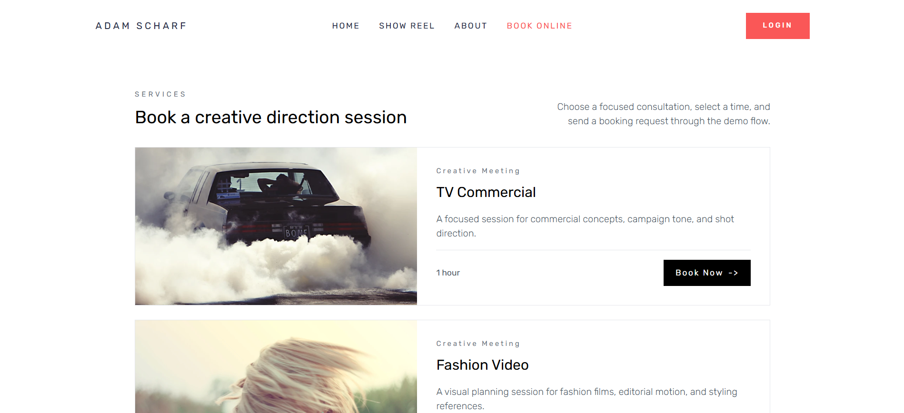
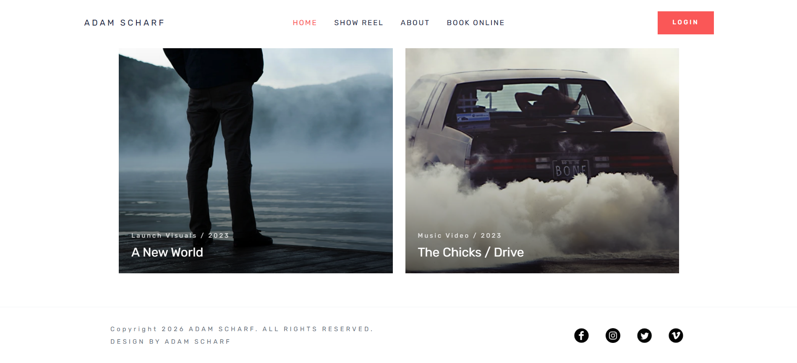

# 🎬 Wix Clone – Creative Portfolio (React + Vite)

A modern, visually-driven **portfolio website clone** inspired by Wix-style creative direction layouts.
Built with **React, Vite, and Tailwind CSS**, this project focuses on **clean UI, storytelling visuals, and a booking flow** — exactly what creative professionals need to impress clients.

---

## 🚀 Live Demo

👉 [https://msadafk.github.io/wix-clone-project](https://msadafk.github.io/wix-clone-project)

---

## 📌 Overview

This project is a **pixel-inspired rebuild** of a creative portfolio website featuring:

* Cinematic hero section
* Clean project showcase grid
* About page storytelling
* Booking system UI
* Smooth navigation experience

The goal was not just cloning design — but **understanding structure, UX flow, and component architecture**.

---

## 🧠 What I Focused On

* Converting a **design-heavy UI into reusable React components**
* Maintaining **visual hierarchy & spacing precision**
* Creating a **realistic booking experience flow**
* Structuring project like a **production-ready frontend app**

---

## 🖼️ Screens Preview

### 🏠 Homepage



---

### 👤 About Page



---

### 📅 Book Online



---

### 📌 Footer



---

## 📌 Overview

This project is a **creative portfolio clone** featuring:

* Cinematic hero section
* Clean project showcase
* About storytelling layout
* Booking flow UI

---

## 🛠️ Tech Stack

| Category      | Tech Used        |
| ------------- | ---------------- |
| Framework     | React 19         |
| Build Tool    | Vite             |
| Styling       | Tailwind CSS     |
| Routing       | React Router v7  |
| Date Handling | date-fns         |
| Date Picker   | react-datepicker |
| Deployment    | GitHub Pages     |

---

## 📂 Project Structure

```
wix-clone-project/
│
├── public/
│   ├── images/
│   ├── videos/
│   └── preview images
│
├── src/
│   ├── assets/        # images, icons
│   ├── components/
│   │   ├── BookOnline/
│   │   ├── pages/
│   │   ├── Header.jsx
│   │   ├── Footer.jsx
│   │   └── reusable UI
│   │
│   ├── data/          # services & projects data
│   ├── App.jsx
│   └── main.jsx
│
└── vite.config.js
```

---

## ⚙️ Installation & Setup

```bash
# Clone repo
git clone https://github.com/msadafk/wix-clone-project.git

# Go to project
cd wix-clone-project

# Install dependencies
npm install

# Run locally
npm run dev
```

---

## 🚀 Deployment

```bash
npm run deploy
```

Deployed using **gh-pages** to GitHub Pages.

---

## ✨ Key Features

* 🎥 Cinematic Hero Section
* 🧩 Component-based architecture
* 📅 Interactive booking UI
* 📱 Fully responsive design
* ⚡ Fast performance with Vite
* 🎨 Clean & minimal UI inspired by creative portfolios

---

## 📈 What I Learned

* How to **break complex UI into reusable components**
* Managing **assets (images/videos) in Vite + GitHub Pages**
* Creating a **real-world booking flow UI**
* Improving **design-to-code accuracy**
* Structuring projects like a **professional frontend developer**

---

## 🎯 Future Improvements

* Add **backend for real booking system**
* Improve **animations (Framer Motion)**
* Add **CMS integration**
* Optimize images for performance
* Add dark mode 🌙

---

## 👨‍💻 Author

**Sadaf (Frontend Developer)**
Focused on building clean, modern, and client-ready UI.

---

## ⭐ If You Like This Project

Give it a ⭐ on GitHub — it helps a lot!

---

## 📬 Feedback

If you have suggestions or improvements, feel free to open an issue or connect!

---

If you want, I can also make a **next-level README (premium style)** with badges, GIF previews, and recruiter-focused storytelling — that one actually helps in getting interviews.
